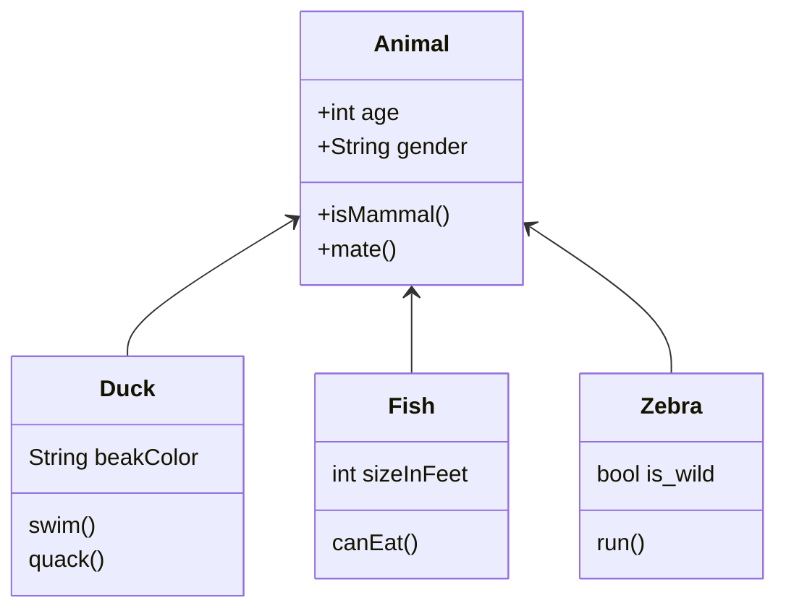
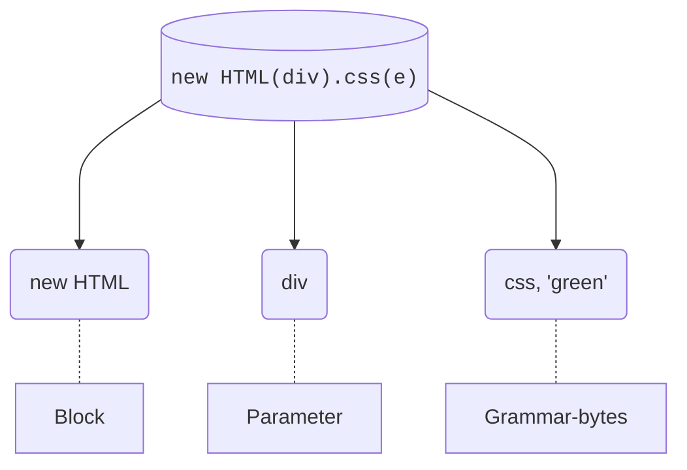

# Molecular anatomy of meta-js
Anatomical disassembly and analysis of meta-javascript, and it's implications in real-world systems and applications.



## In various lenses of analysis...

The metalang syntax as a mathematical function of reasoning:


### Mathematical analysis

$$

\sum  a(b).c(d)... \infin

$$

Where a is the main idea, followed by "b" the main argument/parameter. Along with "c" grammar bytes to "d" describe the chain.

### Plain-text model

```js
new HTML("div").css("split")
      ^    ^     ^     ^
      |    |     |     |
      a    b     c     d
```

- A the block
- B parameter for html tag
- C attacheable grammar to work on the block
- D additional atomic arguments

### Visual
Visual diagram schematic of internal components of metablocks

